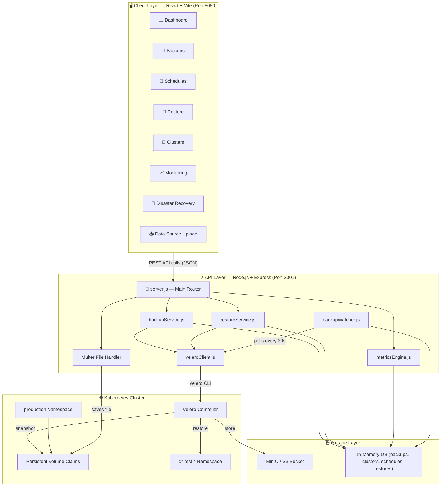
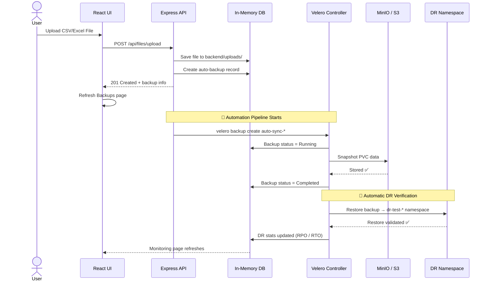
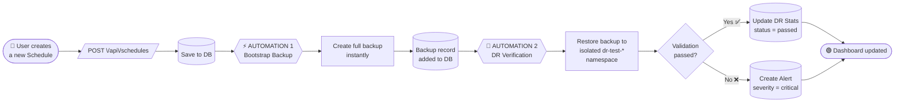
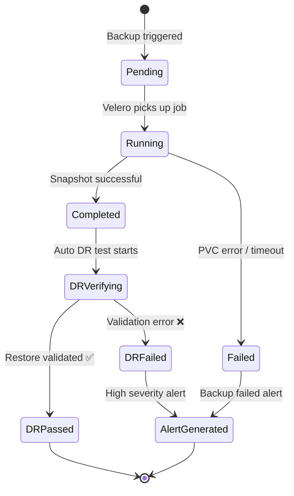
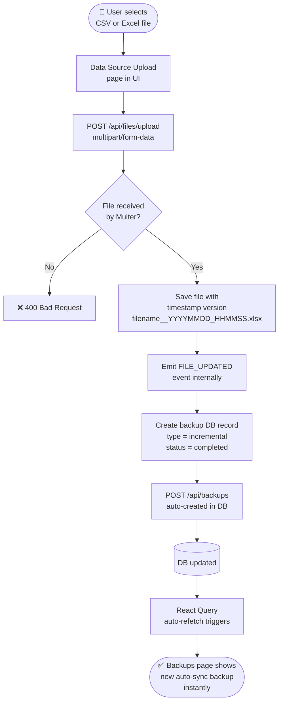
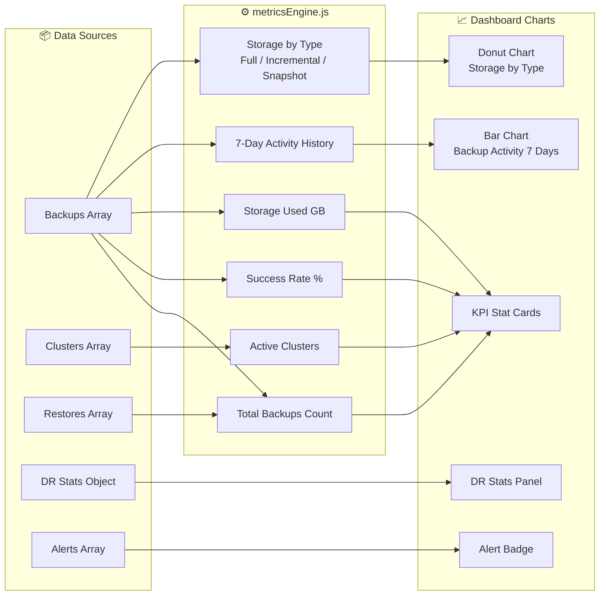

<div align="center">

# ☁️ Kubmanger — Automatic Restore & Backup for Kubernetes

**An autonomous, self-healing Kubernetes data protection platform.**

Backup → Verify → Restore. Fully automated. Zero manual steps.

[](https://nodejs.org)
[](https://react.dev)
[](https://velero.io)
[](LICENSE)

</div>

---

## 🚀 What Is This?

**Kubmanger** is a production-grade Kubernetes backup and disaster recovery control plane. It wraps **Velero** with a beautiful UI and a fully automated backend pipeline that:

1. **Detects** when new data arrives (file upload, schedule trigger)
2. **Backs it up instantly** via Velero into S3-compatible object storage
3. **Automatically validates** the backup by restoring it into an isolated DR namespace
4. **Alerts** you if anything goes wrong — before you even notice

> Think of it as your Kubernetes "Time Machine" — but with autonomous self-verification.

---

## 🏗️ System Architecture



---

## 🔄 Full Automation Workflow



---

## 📅 Bootstrap Backup Pipeline (New Schedule → Instant Protection)



---

## 🔁 Backup State Machine



---

## 📤 File Upload → Automatic Backup Flow



---

## 📊 Metrics Engine — How the Dashboard Works



---

## 🗂️ API Reference

| Method | Endpoint | Description |
|--------|----------|-------------|
| `GET` | `/api/metrics` | Dashboard KPIs, charts, DR stats, alerts |
| `GET` | `/api/backups` | List all backup jobs |
| `POST` | `/api/backups` | Trigger a manual backup |
| `GET` | `/api/schedules` | List all backup policies |
| `POST` | `/api/schedules` | Create policy → auto-triggers bootstrap backup + DR test |
| `GET` | `/api/restores` | List all restore jobs |
| `POST` | `/api/restores` | Initiate a manual restore |
| `GET` | `/api/clusters` | List all connected K8s clusters |
| `POST` | `/api/clusters` | Register a new cluster |
| `GET` | `/api/alerts` | List active system alerts |
| `POST` | `/api/files/upload` | Upload file to PVC → triggers instant backup |
| `GET` | `/api/files` | List all versioned files in PVC |
| `GET` | `/api/files/:name` | Download a specific file version |

---

## ⚡ Quick Start

### 1. Start the Backend API
```bash
cd backend
npm install
node server.js
# ✅ VaultGuard API running on http://localhost:3001
```

### 2. Start the Frontend UI
```bash
cd frontend
npm install
npm run dev
# ✅ UI running on http://localhost:8080
```

---

## 🧩 Tech Stack

| Layer | Technology |
|-------|-----------|
| **Frontend** | React 18, Vite, TypeScript, Tailwind CSS, Radix UI |
| **Data Fetching** | TanStack Query (React Query) with auto-refetch |
| **Charts** | Recharts (Bar + Donut charts) |
| **Animations** | Framer Motion |
| **Backend** | Node.js, Express 5, ESM modules |
| **File Handling** | Multer (multipart upload with timestamp versioning) |
| **K8s Integration** | Velero CLI via `child_process`, `@kubernetes/client-node` |
| **Storage** | MinIO / AWS S3 (via Velero backend) |
| **Containerisation** | Docker + Kubernetes Deployments |

---

## 🌐 Application Pages

| Page | Route | Purpose |
|------|-------|---------|
| Dashboard | `/` | Live KPIs, charts, alerts, DR health |
| Backups | `/backups` | All backup jobs with status, size, type |
| Schedules | `/schedules` | Backup policies + cron config |
| Restore | `/restore` | Initiate and track restores |
| Clusters | `/clusters` | Multi-cluster overview |
| Monitoring | `/monitoring` | Detailed metrics + trends |
| Disaster Recovery | `/disaster-recovery` | DR test results + RPO/RTO |
| Data Source | `/upload-demo` | Upload CSV/Excel → triggers instant backup |
| Architecture | `/architecture` | Visual system diagram |

---

## 🛡️ Key Design Decisions

- **Single unified backend** — all routes including file upload run on one Express server (port 3001), no separate processes needed
- **Stateless in-memory DB** — seeded with realistic data on startup for demo/dev; swap to PostgreSQL/MongoDB in production
- **Isolated DR namespaces** — automated restores always go to `dr-test-*` namespaces, never touching production data
- **Timestamp file versioning** — uploaded files saved as `filename__YYYYMMDD_HHMMSS.ext` for full history
- **React Query auto-refetch** — UI polls backend every 30s automatically so data stays fresh without manual refresh

---

<div align="center">

Built with ❤️ by [kaku-manish](https://github.com/kaku-manish)

</div>
